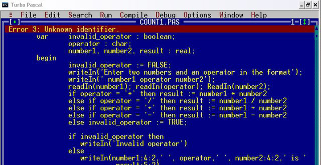
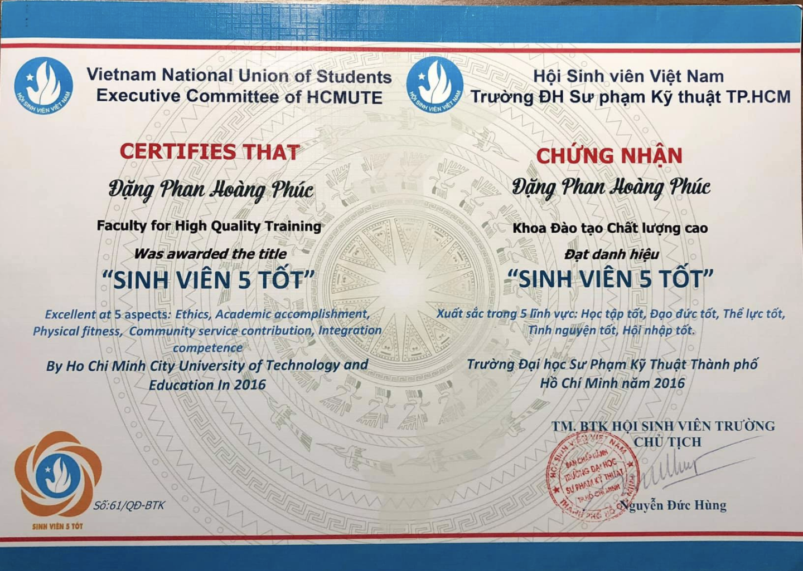
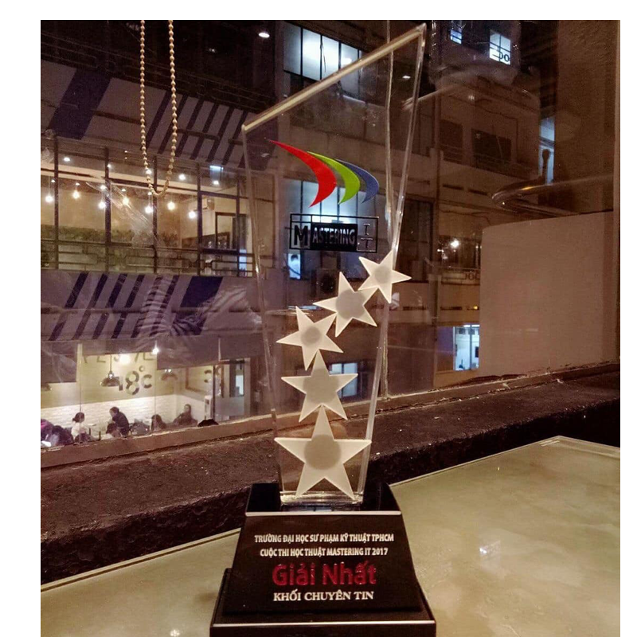
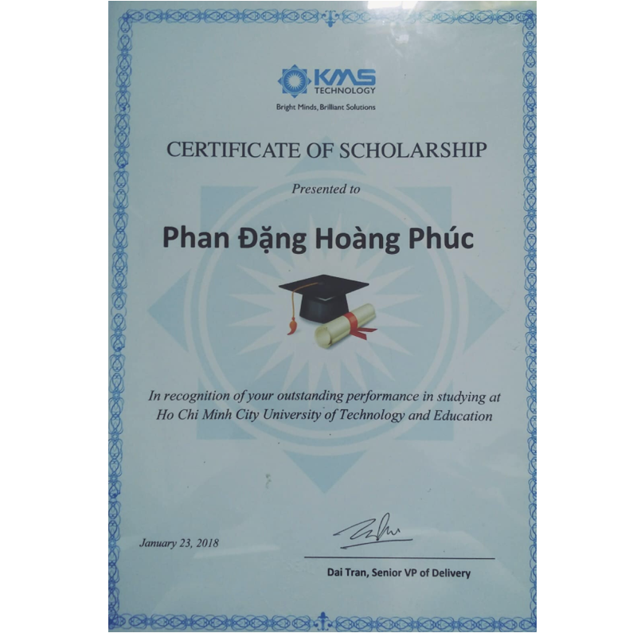

# Tập làm thợ code P1 - Sự bắt đầu

# Thời trung học
Khi còn ở trung học, tôi là một người luôn hứng thú với máy móc công nghệ và có cơ hội tiếp xúc với máy tính rất sớm và lập trình cũng không ngoại lệ. Tôi biết đến lập trình khá sớm so với các lập trình viên tại Việt Nam hiện nay (lúc 12 tuổi). Đó là vào năm 2008, khi mới chỉ là học sinh lớp 7, tôi đọc qua quyển sách Tin học lớp 8 và biết được đến ngôn ngữ lập trình **Pascal**. Thông qua một người thầy cũ là giáo viên môn Toán - thầy Sơn, tôi được thầy hướng dẫn về lập trình **Pascal** - một điều khá mới mẻ vào thời điểm đấy, cảm giác ngồi gõ phím trước một cái màn hình xanh lè và đầy những dòng chữ mà chả mấy người hiểu, thật là cool ngầu. Và đó là cách mà tôi đã dấn thân vào con đường tà đạo này =)).

Đến năm 2010, tôi có cơ hội tham gia cuộc thi lập trình thuật toán đầu tiên trong đời là Hội thi Tin học trẻ tỉnh Đak Nông và may mắn có giải thưởng ngay lần đầu tham gia. Khoảng 3 tháng sau, tôi đã tham gia cuộc thi học sinh giỏi cấp tỉnh môn Tin học và cũng may mắn có giải thưởng cao nhất đoàn thời điểm đó. Kết thúc một năm học như mơ.

Lên cấp 3, tôi lại được góp mặt trong đội tuyển thi tin học của trường và được tiếp xúc với khá nhiều kiến thức mới mẻ đối với tôi vào thời điểm đó (Tree, Graph,..). Tuy nhiên, do vấn đề về nhân sự và nguồn lực của trường (những giáo viên tin học ở tỉnh lẻ không có nhiều kiến thức chuyên sâu về mảng này) nên tôi đành ngậm ngùi dừng bước :(

# Đại học

Bắt đầu tiếp xúc với Công nghệ nhiều hơn khi tôi trúng tuyển vào ngành Công nghệ thông tin của *Trường Đại Học Sư Phạm Kỹ Thuật TP. HCM* - nghe có vẻ không liên quan gì đến CNTT. Đây luôn là một trong sự hối hận lớn nhất cuộc đời tôi vì đã không học hành tốt hơn ở trung học :((

Tất nhiên, thất vọng cũng không giúp được gì, nên tôi học cách chấp nhận với những gì mình đang sở hữu hiện tại và cố gắng nhiều hơn. Trong năm đầu tiên của đại học, không có nhiều ngày được ngủ trước 12h, tôi luôn cố gắng trao dồi bản thân để bù đắp cho quãng thời gian trước đó và thành quả là tôi nhận được tổng cộng 7 học bổng trong thời gian ngồi trên ghế nhà trường, và đi cùng đó là khá nhiều thành tích và giải thưởng như *Sinh viên 5 tốt*, *Mastering IT*,...

# Thực tập và công ty đầu tiên trong đời

Đó là một ngày của sinh viên năm 3, khi đã học vượt khá nhiều môn và tôi có một quyết định táo bạo là học vượt môn chuyên ngành là *Công nghệ phần mềm mới* (may mắn sau trúng tuyển vào đúng chuyên ngành, không thì công cốc). Tại lớp học này, tôi may mắn được học chung với các anh chị cuối khóa và học hỏi được rất nhiều kỹ năng, kinh nghiệm từ người đi trước.
Thời điểm đó cũng là thời điểm mà những sinh viên cuối cấp đó bắt đầu kỳ thực tập của mình. Một ngày đẹp trời, mình được các anh chị giới thiệu rằng công ty **Kins Solutions** (ngày nay là **Fetch Technology**) hiện tại đang tuyển thực tập sinh. Sau ít thời gian tham khảo và tìm hiểu thì tôi bắt đầu viết một chiếc CV thật hoành tráng và apply (chém gió chứ thời đó có gì đâu mà viết :v). Thế là tôi Google đủ thể loại các câu hỏi phỏng vấn Developer để tìm hiểu, thế là lòi ra một đống kiến thức mới lạ, chưa từng nghe đến tên bao giờ, cảm thấy hơi lo lắng vì đây là lần đầu.

Trước giờ xem phim thấy các công ty ở các building khang trang, xịn xò. Và khi đến công ty thì thật sự bất ngờ, công ty không hoành tráng như những gì tưởng tượng, nhưng lại mang lại một cảm giác rất gần gũi. Tôi đến công ty vào lúc công ty đang tổ chức Happy Hour, mọi người đang ăn uống nhẹ, chơi banh bàn, đá Pes. Tôi có cơ hội tiếp xúc với mọi người và cũng bớt phần nào lo lắng, buổi phỏng vấn cũng nhờ đó mà diễn ra khá suôn sẻ (thực ra intern thì có phỏng vấn gì nhiều đầu :v). Khoảng vài ngày sau, tôi nhận được cuộc gọi báo mình đã pass, và thế là bắt đầu khăn gói đi thực tập, thời gian mà được coi là khá sớm đối với một sinh viên.

To be continued...